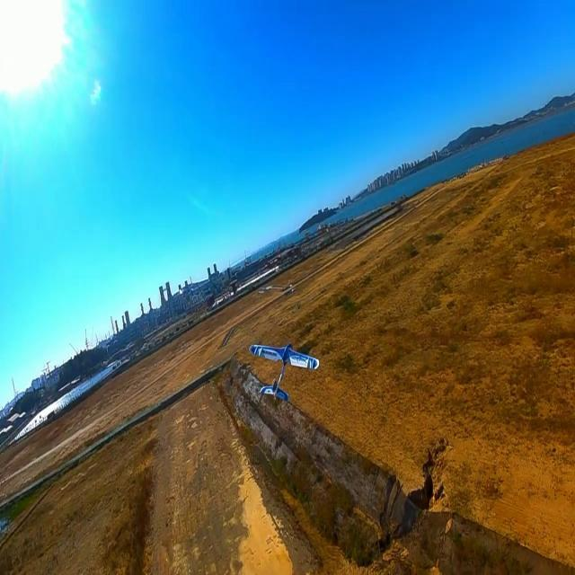
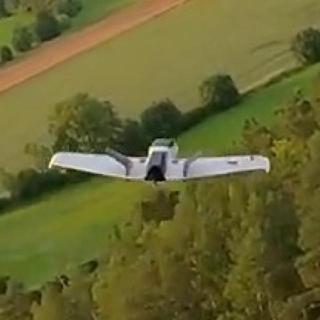
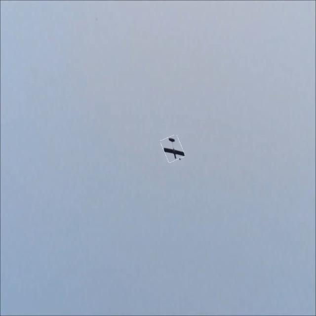
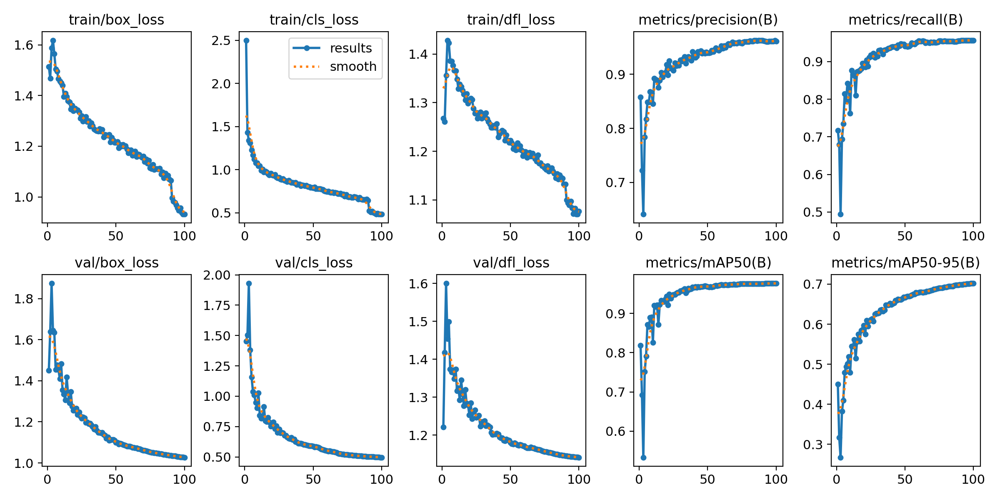
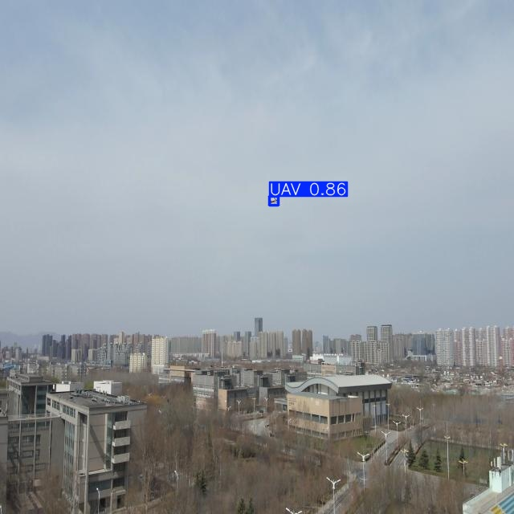
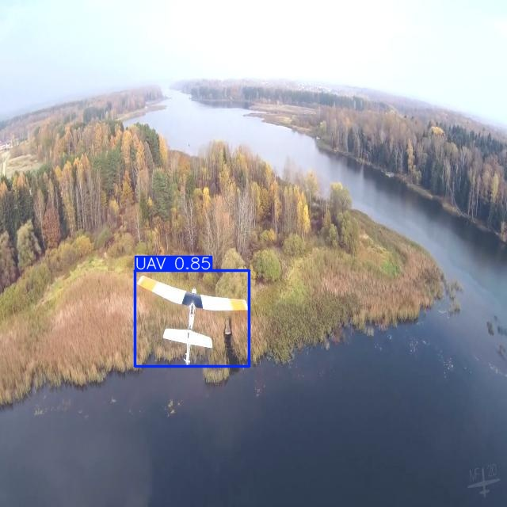
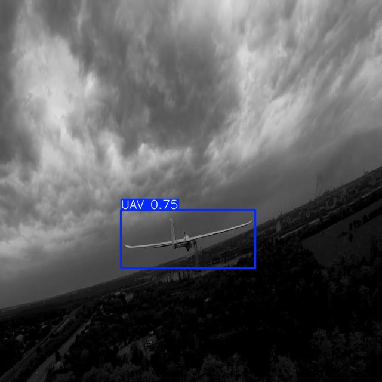

# UAV Detection

UAV detection is a critical task in modern surveillance and security systems. The increasing use of UAVs for various purposes has led to a growing concern about their potential misuse, such as terrorism, smuggling, and privacy violations. Therefore, it is essential to develop a robust UAV detection system that can detect and track UAVs in real-time. This project is developed for handling these challenges and providing a solution for UAV detection and tracking. 


---

## 📁 Project Structure

```text
uav_detection/
├── configs/                  # YAML configuration files
│   ├── train_config.yaml     # Training parameters
│   ├── test_config.yaml      # Evaluation metrics parameters
│   └── infer_config.yaml     # Inference and tracking parameters
├── src/                      # Source code for the pipeline
│   ├── train.py              # Model training script
│   ├── evaluate.py           # Evaluation and metrics generation
│   ├── infer.py              # Inference and tracking script
│   └── export.py             # Export to ONNX, TensorRT, CoreML, etc.
├── notebook/                 # Exploratory Jupyter Notebooks
├── data/                     # (Ignored) Datasets and test media
├── runs/                     # (Ignored) YOLOv8 output logs and weights
├── requirements.txt          # Python dependencies
└── README.md                 # Project documentation
```

---

## 🚀 Setup & Installation

1. **Clone the repository and navigate to the project directory:**
   ```bash
   git clone https://github.com/bit-wander/SwiftSentinel.git 
   cd SwiftSentinel 
   ```

2. **Create a virtual environment (Recommended):**
   ```bash
   python -m venv .venv
   source .venv/bin/activate  # On Windows: .venv\Scripts\activate
   ```

3. **Install dependencies:**
   ```bash
   pip install -r requirements.txt
   ```

---

## 📊 Dataset Information

The model is trained on a custom dataset consisting of aerial imagery for UAV detection.  

### Classes & Backgrounds
- `0`: `uav` (Unmanned Aerial Vehicle)
- **Background Images**: The dataset intentionally includes background images (images with no UAVs, represented by empty or missing label files) to teach the model to reduce False Positives (FP) during inference.

### Dataset Distribution
The combined dataset contains a total of **15,865 images**:
| Split | Total Images | UAV Images | Background Images |
| :--- | :--- | :--- | :--- |
| **Train** | 11,921 | 11,567 | 354 |
| **Valid** | 2,096 | 1,995 | 101 |
| **Test** | 1,848 | 1,797 | 51 |
| **Total** | **15,865** | **15,359** | **506** |

### Structure & Sample Data
The dataset follows the standard YOLO format and is split into `train`, `valid`, and `test` directories.

**Directory Structure:**
```text
master_dataset/
├── train/
│   ├── images/ (e.g., frame_001.jpg)
│   └── labels/ (e.g., frame_001.txt)
├── val/
...
```

**Sample Annotation (`.txt` file):**
Each label file contains one row per bounding box in the format: `<class_id> <x_center> <y_center> <width> <height>` (normalized between 0 and 1).
```text
# class_id  x_center   y_center   width      height
0           0.5432     0.3121     0.0543     0.0215
```

**Visualization Samples:**

<p align="center">
  
  
  
</p>


---

## 🧠 Pipeline Usage

### 1. Training
Configure your dataset and training parameters in `configs/train_config.yaml`, or override them directly via the command line.
*Note: To track experiments with ClearML, uncomment the `clearml` section in the config.*

Run the training script:
```bash
# Run with defaults from yaml
python src/train.py --config configs/train_config.yaml

# Override model, epochs, and batch size via CLI
python src/train.py --model yolov8s.pt --epochs 50 --batch 64
```

### 2. Evaluation
To evaluate your trained model against a validation or test set and generate standard metrics (mAP50, mAP50-95):

Update `configs/test_config.yaml` to point to your dataset and trained weights, or override them directly via the command line:
```bash
# Run with defaults from yaml
python src/evaluate.py --config configs/test_config.yaml

# Override weights, split, and confidence threshold via CLI
python src/evaluate.py --weights runs/detect/train/weights/best.pt --split val --conf 0.50
```
*Results will be displayed in the terminal and saved in `evaluation_results.json`.*

### 3. Inference & Tracking
You can run real-time inference or tracking on video files, image directories, or webcam streams. Edit `configs/infer_config.yaml` to set your target `source`, `track` flag (to enable tracking), and thresholds, or override them dynamically via the command line.

```bash
# Run inference with defaults from yaml
python src/infer.py --config configs/infer_config.yaml

# Override source and enable tracking via CLI
python src/infer.py --source data/test_video.mp4 --track --conf 0.4
```

### 4. Edge Export
Deploying to a Jetson Nano, Raspberry Pi, or other edge devices requires optimized model formats. You can easily export the `.pt` weights to formats like ONNX or TensorRT (`.engine`).

```bash
python src/export.py --weights runs/detect/train/weights/best.pt --format onnx
```

---

## 📈 Results

### Quantitative Analysis
The model's training performance and evaluation metrics across all epochs are visualized below, detailing losses, precision, recall, and mAP scores.



### Qualitative Analysis
Below are sample inference results demonstrating the model's capability to detect UAVs accurately:

<p align="center">
  
  
  
</p>


